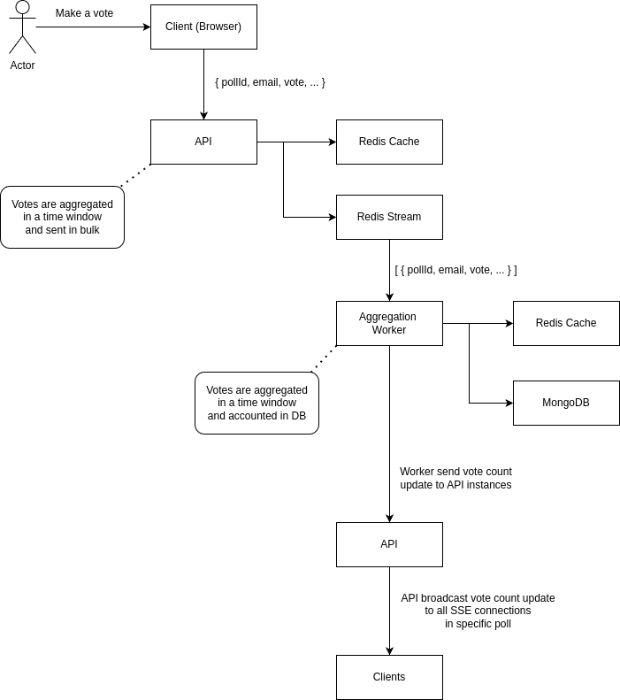
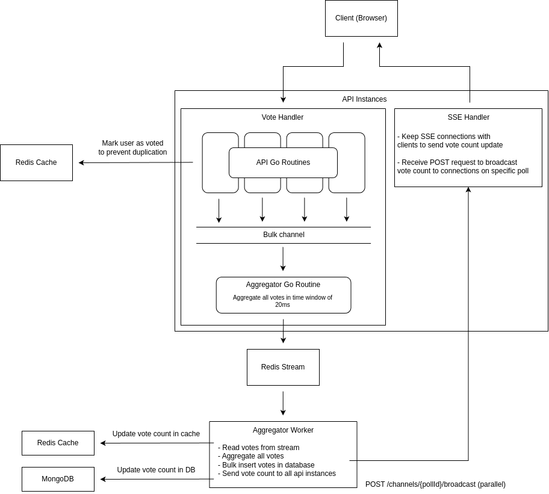

# poll.go

# Folder Structure
```
poll-platform/
│
├── Makefile                              ← top-level: make dev, make build,
│                                           make test, make deploy
│                                           delegates into backend/ and frontend/
├── README.md                             ← this document
├── .env.example                          ← all env vars documented, no real values
│
├── .github/
│   └── workflows/
│       ├── ci.yml                        ← test + lint on PR (Go + frontend)
│       ├── deploy-api.yml                ← build + push api image on merge to main
│       ├── deploy-worker.yml             ← build + push worker image on merge to main
│       └── deploy-frontend.yml           ← build + deploy frontend on merge to main
│
├── backend/                              ← self-contained Go module
│   │                                       go tooling, gopls, and linters
│   │                                       root themselves here, never at repo root
│   ├── go.mod                            ← module poll-platform/backend
│   ├── go.sum
│   │
│   ├── cmd/
│   │   ├── api/
│   │   │   └── main.go                   ← API binary: HTTP server, routes,
│   │   │                                   SSE setup, graceful shutdown
│   │   └── worker/
│   │       └── main.go                   ← Worker binary: discovery loop,
│   │                                       drain loops, graceful shutdown
│   │
│   └── internal/                         ← shared Go code, not importable
│       │                                   outside this module
│       ├── accumulator/
│       │   ├── accumulator.go            ← mutex buffer + 20ms flush goroutine
│       │   └── accumulator_test.go
│       │
│       ├── gate/
│       │   ├── gate.go                   ← Redis SADD/SISMEMBER dedup gate
│       │   └── gate_test.go
│       │
│       ├── stream/
│       │   ├── producer.go               ← XADD (used by api)
│       │   ├── consumer.go               ← XREADGROUP, XACK, XTRIM, XAUTOCLAIM
│       │   │                               (used by worker)
│       │   └── stream_test.go
│       │
│       ├── lock/
│       │   ├── lock.go                   ← SET NX PX acquire/release
│       │   ├── keepalive.go              ← EXPIRE refresh goroutine
│       │   └── lock_test.go
│       │
│       ├── discovery/
│       │   ├── discovery.go              ← SCAN votes:* loop, self-assigns
│       │   │                               streams to this worker via Redis lock
│       │   └── discovery_test.go
│       │
│       ├── counter/
│       │   ├── counter.go                ← HINCRBY, HGETALL live counts
│       │   └── counter_test.go
│       │
│       ├── broadcast/
│       │   ├── broadcast.go              ← parallel HTTP POST to API instances,
│       │   │                               200ms timeout, fire-and-forget
│       │   └── broadcast_test.go
│       │
│       ├── registry/
│       │   ├── registry.go               ← API instance address discovery
│       │   │                               (k8s headless DNS / Consul / env list)
│       │   └── registry_test.go
│       │
│       ├── store/
│       │   ├── votes.go                  ← MongoDB insertMany vote records
│       │   ├── votes_test.go
│       │   ├── polls.go                  ← MongoDB poll documents,
│       │   │                               recount query for Redis rebuild
│       │   └── polls_test.go
│       │
│       └── config/
│           └── config.go                 ← loads + validates all env vars into
│                                           typed struct on startup; both binaries
│                                           import this, fail fast if var missing
│
├── frontend/                             ← self-contained Node module
│   ├── package.json
│   ├── tsconfig.json
│   ├── vite.config.ts
│   ├── .env.example
│   │
│   ├── src/
│   │   ├── main.ts
│   │   ├── App.tsx
│   │   │
│   │   ├── pages/
│   │   │   ├── PollPage.tsx              ← vote submission + live result display
│   │   │   └── ResultsPage.tsx           ← final results after poll closes
│   │   │
│   │   ├── components/
│   │   │   ├── PollOption.tsx            ← option button + animated bar
│   │   │   ├── ResultBar.tsx             ← percentage bar, animates on SSE update
│   │   │   └── ConnectionStatus.tsx      ← SSE connected / reconnecting indicator
│   │   │
│   │   ├── hooks/
│   │   │   ├── usePollResults.ts         ← owns all EventSource lifecycle:
│   │   │   │                               open, message, error, reconnect backoff
│   │   │   │                               exposes counts + connection state only
│   │   │   └── useVote.ts                ← POST /polls/{pollId}/vote,
│   │   │                                   handles 202 and 409 (already voted)
│   │   │
│   │   ├── lib/
│   │   │   └── api.ts                    ← base URL config, typed fetch wrappers
│   │   │
│   │   └── types/
│   │       └── poll.ts                   ← Poll, Option, VoteResult types
│   │
│   └── public/
│       └── favicon.ico
│
├── infra/
│   │
│   ├── terraform/                        ← cloud resource provisioning
│   │   ├── main.tf
│   │   ├── variables.tf
│   │   ├── outputs.tf
│   │   ├── versions.tf
│   │   └── modules/
│   │       ├── gke/                      ← (or eks/) Kubernetes cluster
│   │       ├── redis/                    ← Memorystore / ElastiCache
│   │       ├── mongodb/                  ← Atlas / DocumentDB / self-hosted
│   │       └── networking/               ← VPC, subnets, firewall rules
│   │
│   ├── k8s/                              ← Kubernetes manifests
│   │   ├── namespace.yaml
│   │   │
│   │   ├── api/
│   │   │   ├── deployment.yaml           ← image, replicas, env refs,
│   │   │   │                               readiness probe
│   │   │   ├── service.yaml              ← ClusterIP for ingress traffic
│   │   │   ├── hpa.yaml                  ← HorizontalPodAutoscaler
│   │   │   └── headless-service.yaml     ← exposes individual pod IPs so
│   │   │                                   worker registry can discover them
│   │   │
│   │   ├── worker/
│   │   │   ├── deployment.yaml           ← image, replicas (2: active + standby)
│   │   │   └── service.yaml              ← no ingress; worker is outbound only
│   │   │
│   │   └── configmap.yaml                ← non-secret env vars shared by both
│   │                                       binaries (Redis host, Mongo host, etc.)
│   │
│   ├── helm/                             ← wraps k8s/ into a parameterized chart
│   │   └── poll-platform/
│   │       ├── Chart.yaml
│   │       ├── values.yaml               ← defaults (image tags, replicas, limits)
│   │       ├── values.prod.yaml
│   │       ├── values.staging.yaml
│   │       └── templates/                ← same resources as k8s/ but templated
│   │
│   └── docker/
│       ├── api.Dockerfile                ← multi-stage: build Go binary (context:
│       │                                   ./backend) → minimal runtime image
│       ├── worker.Dockerfile             ← same pattern (context: ./backend)
│       └── docker-compose.yml            ← local dev: api + worker + redis +
│                                           mongodb + mongo-express + frontend dev
│                                           server. only file that sees full repo.
│
└── scripts/
    ├── seed.go                           ← creates test polls in MongoDB for
    │                                       local dev and integration tests
    ├── load-test.sh                      ← k6 script: N concurrent voters
    │                                       across M polls simultaneously
    └── recount.go                        ← rebuilds Redis counters from MongoDB
                                            vote records; run after Redis data loss
```

# Architecture



